# 編集方法

:::info

この記事はGitがわからない人向けです  
分かる人はいい感じにやってください

:::

Git を用いての他の人との作業を円滑に進めるために、以下の手順に則って編集を行うようにお願いします

ざっくりとした手順は以下のとおりです

0. 作業データの更新
   他の人による更新がないか確認し、あれば更新します
1. 作業用ディレクトリの作成
   他の人と作業内容が被らないように作業用にディレクトリを分けます
2. 編集
   ファイルを編集します
3. ファイルをアップロード
   変更を保存し、サーバーにアップロードします
4. 自動チェック
   自動的にファイルの内容のチェックが行われます
5. 編集内容の統合
   問題がなければ変更内容を反映します

## 0. 作業データの更新

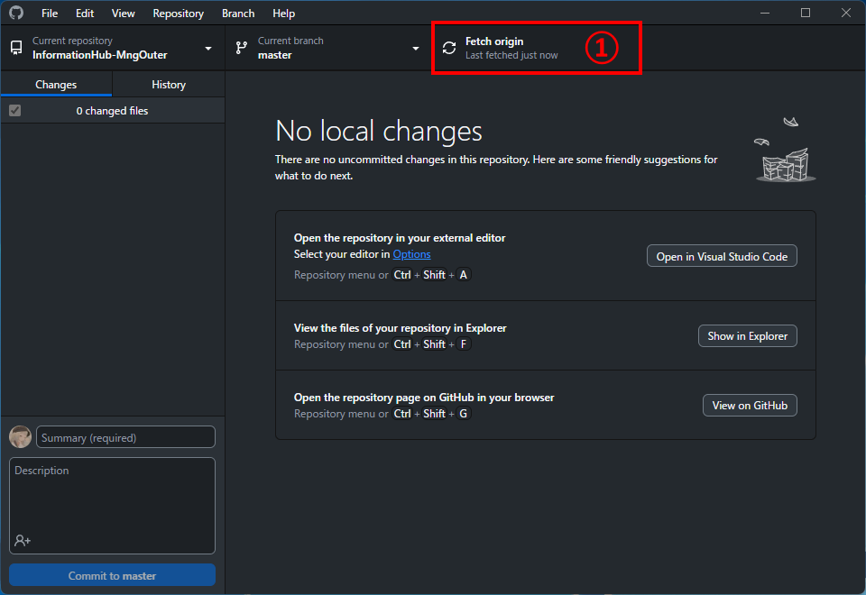

`① Fetch origin` を押し、データを更新します

## 1. 作業用ディレクトリの作成

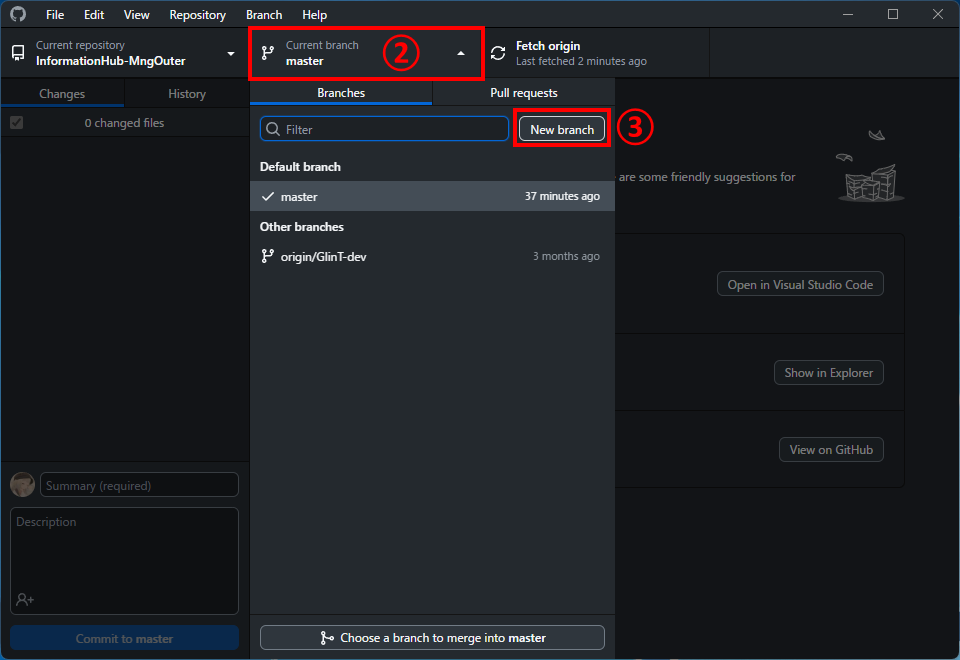

`② Current branch` を押し、表示されるメニューから、 `③ New branch` を押します

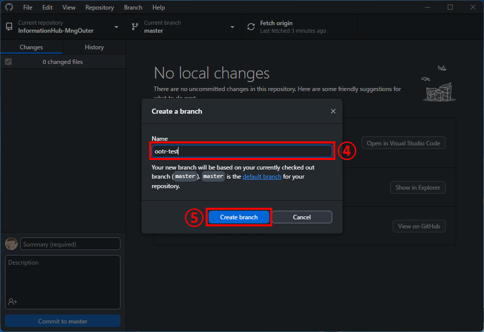

`④ Name` を決め、 `⑤ Create branch` を押して作業ディレクトリを作成します
:::note

名前は重複が不可のため、 `自分の名前-作業内容` といった形にするとよいです
(画像内においては `ootr-test` という名前にしています)

:::

## 2. 編集

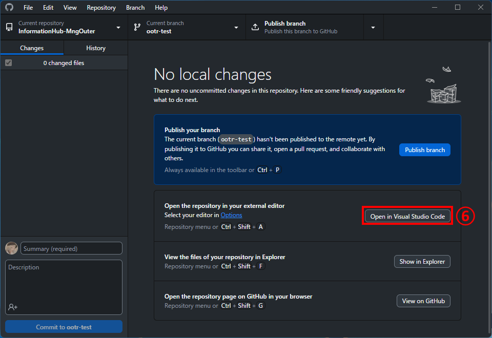

`⑥ Open in Visual Studio Code` を押し、VSCodeを開きます

各ファイルは `docs` フォルダー以下にあります

## 3. ファイルをアップロード

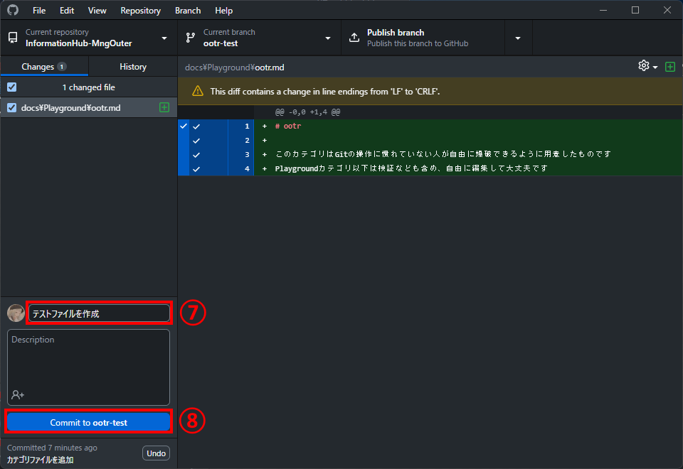

`⑦` に、作業内容の概要を書き、`⑧ Commit to <ootr-test>` を押して、変更を保存します

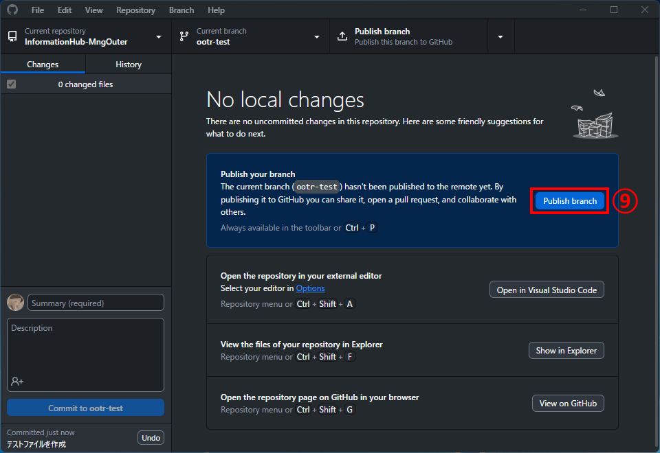

`No local changes` と表示されていることを確認し、`⑨ Publish branch` を押して変更をアップロードします

## 4. 自動チェック

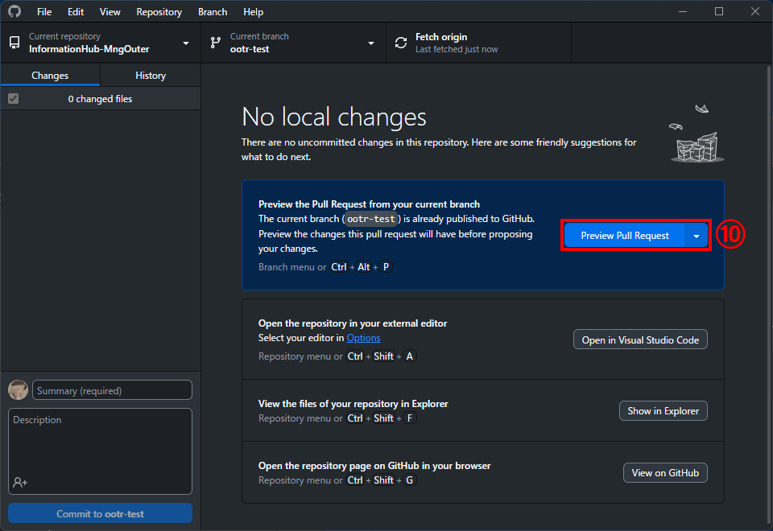

`⑩ Preview Pull Request` を押し、

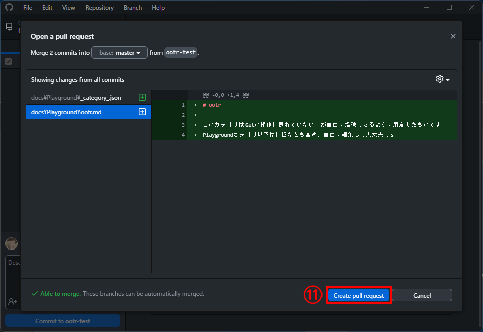

`⑪ Create pull request` を押します

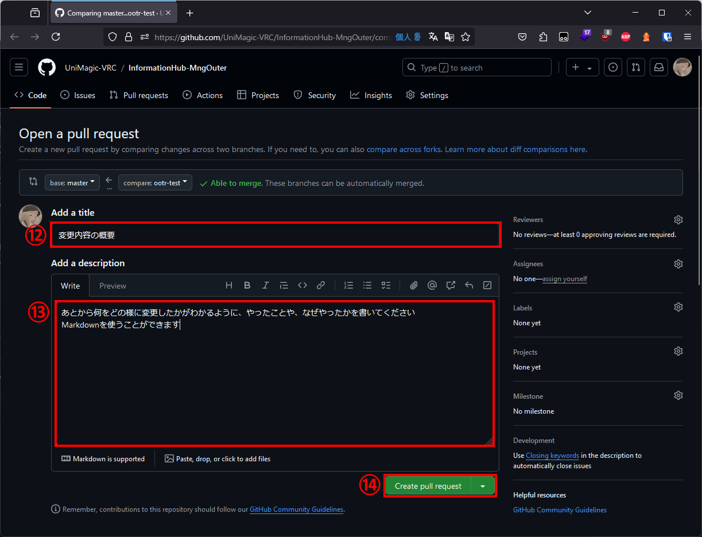

ブラウザが開くため、⑫⑬を埋め、⑭を押します

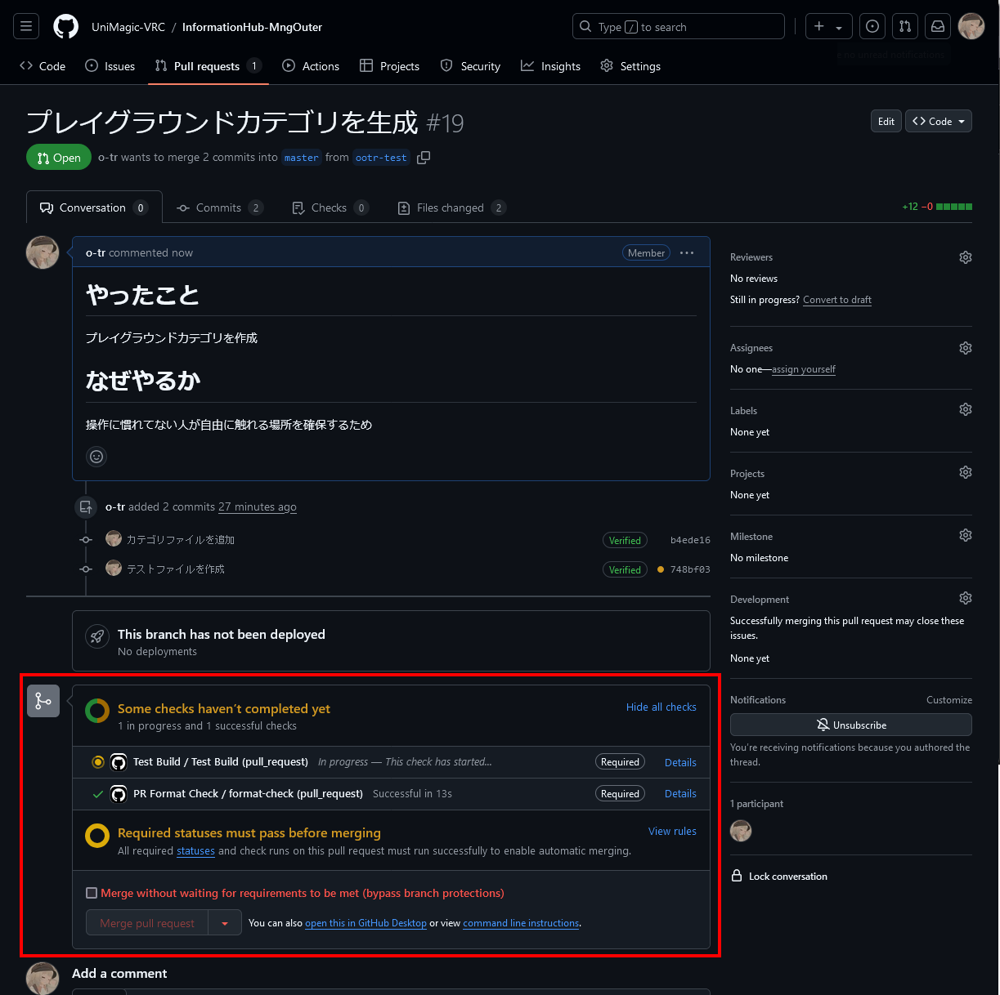

画面が切り替わり、テストが実行されます

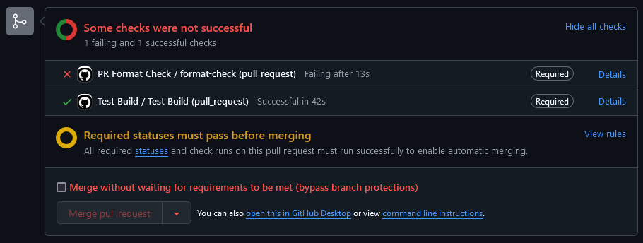

上記のように `Some checks were not successful` と表示された場合はなにかしらの問題があります

何が間違っているかわからない場合は技術部辺りまでお問い合わせください

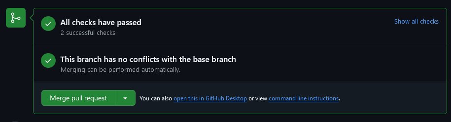

上記のように `All checks have passed` と表示されている場合は問題ありません

## 5. 編集内容の統合

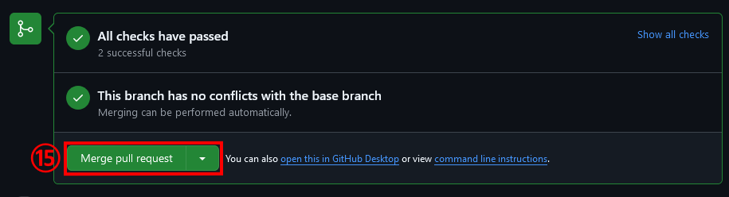

`⑮ Merge pull request` を押します

これ以外のボタンが表示されている場合は技術部辺りまでお問い合わせください

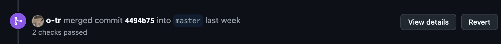

上記のように `merged` と表示されれば完了です

お疲れ様でした
